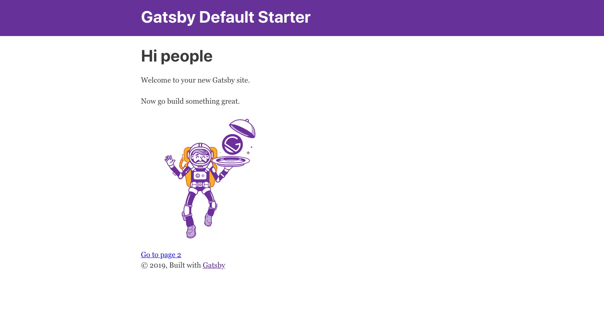
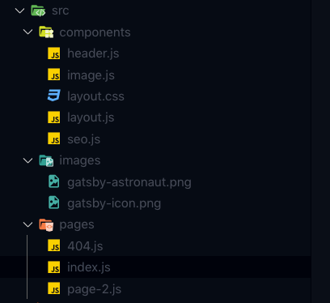

> Let's get started with gatsby. To know what Gatsby is please follow the [Gatsby Official Website](https://www.gatsbyjs.com/) . Here in this post we will directly dive into setting up Gatsby and exploring the file structure.

## Introduction

To give a little overview, Gatsby is a static site generator which is based on
React. So if you like react and want to build a website which is blazing fast,
Gatsby is the best bet. There are several ways to get data into Gatsby, like
from CMS's (Wordpress, Contentfull), API's and even Markdown which we will be
using to build a blog in later posts.

## Installing Gatsby CLI

Gatsby CLI is a tool that help us to create, develop and build new Gatsby powered websites. CLI should be installed globally with the following command.

> Latest version of Node and NPM should be installed before running the command.

<CodeTitle title="terminal" language="shell" />

```shell

npm install -g gatsby-cli

```

## Creating New Gatsby Project

Gatsby provides a lot of starter templates for a project, some of them are official some are community made. You can explore the starters from the website Gatsby Starters . But for this post and future gatsby post on the blog we will use the default gatsby starter. You can create a new gatsby project by running the following command.

<CodeTitle title="terminal" language="shell" />

```shell

gatsby new gatsbtDeznit

```

Once the project is created and all the packages are installed we can move forward, and cd into the folder and run the website.

<CodeTitle title="terminal" language="shell" />

```shell

cd gatsbyDeznit
gatsby develop

```

The gatsby develop command will build the site and serve a development server on localhost:8000 with hot reloading. At the time of writing the blog the default starter looks like the image below.



## Moving Forward 🚀

The next step is to edit the pages and create a fast website, but for that we must understand where and what to edit. To keep it short we will be just exploring the important files, and later onn in future posts we will digg deep into other files and folders.

> Routes are automatically generated for files in pages folder. If you want to programatically create pages refer This Post



### index.js

This is the home page of the site. We can edit this file to change the home page.

### layout.js

This is the wrapper for our pages. We can add components that we want to be constant in multiple pages here, like the header and footer. We can have different layouts for different pages.

### header.js

Header component have the styling for the header. similarly we can create different components and use it all through our site, with ease.
